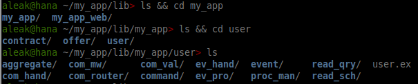
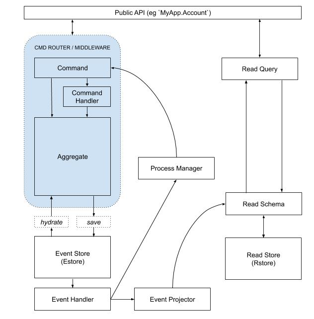

# PhoenixCommanded

[Commanded][com] code generators for the [Phoenix Framework][phx]

This is a WORK IN PROGRESS, not yet ready for live use!

This repo provides generators for rapid creation of Phoenix/Commanded apps.
The intended audience is new Commanded developers, to generate demo code and to
get experimental apps up and running quickly.  

Experienced Commanded developers should bypass this scaffolding and use the
Commanded tooling directly.

[com]: https://github.com/commanded/commanded
[phx]: https://phoenixframework.org

## Installation

First, generate a Phoenix app:

    mix phx.new my_app

Then install this package by adding `phoenix_commanded` to your list of
dependencies in `my_app/mix.exs`:

```elixir
def deps do
  [
    {...},
    {:phoenix_commanded, git: "https://github.com/andyl/phoenix_commanded"}
  ]
end
```

Then run a series of mix commands to configure your app.

```
$ cd my_app
$ mix deps.get
$ mix phxcmd.add.config
$ mix phxcmd.add.estore
$ mix phxcmd.gen.html User name:string balance:float
```

Start your app with `mix phx.server`. Point your browser to `localhost:4000`.

## Mix Commands

Run `mix phxcmd` to see all generators and generator options.

## Commanded Elements

Each generated context will contain a standard set of Commanded elements.

| Element            | Directory    | Module Name           | Alias |
|--------------------|--------------|-----------------------|-------|
| API                | /            | MyApp.User            | User  |
| Aggregate          | aggregate/   | MyApp.User.Aggregate  | A     |
| Command            | command/     | MyApp.User.Command    | C     |
| Command Middleware | com_mw/      | MyApp.User.ComMw      | CM    |
| Command Handler    | com_hand/    | MyApp.User.ComHand    | CH    |
| Command Router     | com_router/  | MyApp.User.ComRouter  | CR    |
| Command Validator  | com_val/     | MyApp.User.ComVal     | CV    |
| Event              | event/       | MyApp.User.Event      | E     |
| Event Handler      | ev_hand/     | MyApp.User.EvHand     | EH    |
| Event Projector    | ev_pro/      | MyApp.User.EvPro      | EP    |
| Process Manager    | proc_man/    | MyApp.User.ProcMan    | PM    |
| Read Schema        | read_schema/ | MyApp.User.ReadSchema | RS    |
| Read Query         | read_query/  | MyApp.User.ReadQuery  | RQ    |

Here's a CLI view...



Here's how the Commanded elements flow together...



