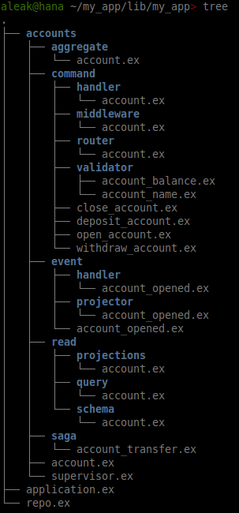

# PhoenixCommanded

A [Commanded][com] code generator for [Phoenix][phx] applications.  This is
UNDER CONSTRUCTION, not ready for live use!

The intended audience is new Commanded developers, to get experimental apps up
and running quickly.  

Experienced Commanded developers should bypass this scaffolding and use the
Commanded tooling directly.

The overall direction is to explore the feasibility of generating a Commanded
application from a data-structure like [GraphQL SDL][sdl].  I'll slowly chip
away at this, and welcome collaborators and PRs.  Chat about Commanded on
[Gitter][git] or [Slack][slk].

[com]: https://github.com/commanded/commanded
[phx]: https://phoenixframework.org
[sdl]: https://graphql.org/learn/schema
[gtr]: https://gitter.im/commanded/Lobby
[slk]: https://elixir-lang.slack.com

## Instructions

First, generate a Phoenix app:

```
$ mix phx.new my_app
$ cd my_app
```

Then install this package by adding `phoenix_commanded` to your list of
dependencies in `my_app/mix.exs`:

```elixir
def deps do
  [
    {...},
    {:phoenix_commanded, git: "https://github.com/andyl/phoenix_commanded"},
  ]
end
```

Then run mix commands to configure and run your app.

```
$ mix deps.get
$ mix phxcmd.add.config    # add Commanded config w/comspec
$ mix phxcmd.add.estore    # add Commanded event-stores
$ mix phxcmd.gen.code      # generate Aggregates, Commands, Events, ...
$ mix compile              # compile the generated code
$ mix ecto.create          # create read-store 
$ mix ecto.migrate         # migrate the read-store
$ mix test                 # run tests
$ mix phx.server           # run server
```

Now point your browser to `localhost:4000`.

## Mix Commands

Run `mix phxcmd` to see all generators and generator options.

## The Comspec

Phxcom code generation is specified as a configuration option in the file
`config/commanded.exs`.  (see the `commanded/comspec` section...)

You can view the comspec with the command `$ mix phxcmd.show.comspec`.

## Commanded Elements

Each generated context will contain a standard set of Commanded elements.

| Element            | Directory           | Alias |
|--------------------|---------------------|-------|
| API                | /                   | User  |
| Aggregate          | aggregate/          | A     |
| Command            | command/            | C     |
| Command Middleware | command/middleware/ | CM    |
| Command Handler    | command/handler/    | CH    |
| Command Router     | command/router/     | CR    |
| Command Validator  | command/validator/  | CV    |
| Event              | event/              | E     |
| Event Handler      | event/handler/      | EH    |
| Event Projector    | event/projector/    | EP    |
| Read               | read/               | R     |
| Read Schema        | read/schema/        | RS    |
| Read Query         | read/query/         | RQ    |
| Saga (ProcessMgr)  | saga/               | S     |

Here's how things look on the filesystem...



Here's how the Commanded elements flow together...


## Design Notes

Database: We use Postgres for the Event Store, for `:dev`, `:prod` and `:test`

Context API: We generate the same API interface as is used by the standard
Phoenix/Ecto generators.  Your Commanded contexts should be interoperable with
a Phoenix-generated context, and should work seamlessly with Phoenix-generated
views.

